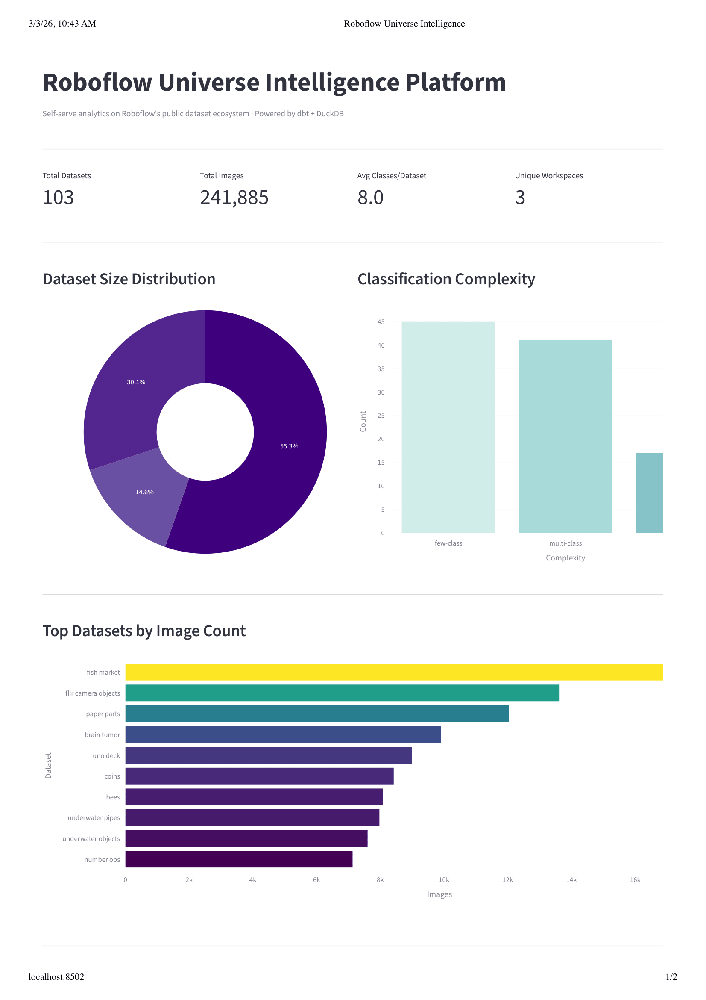
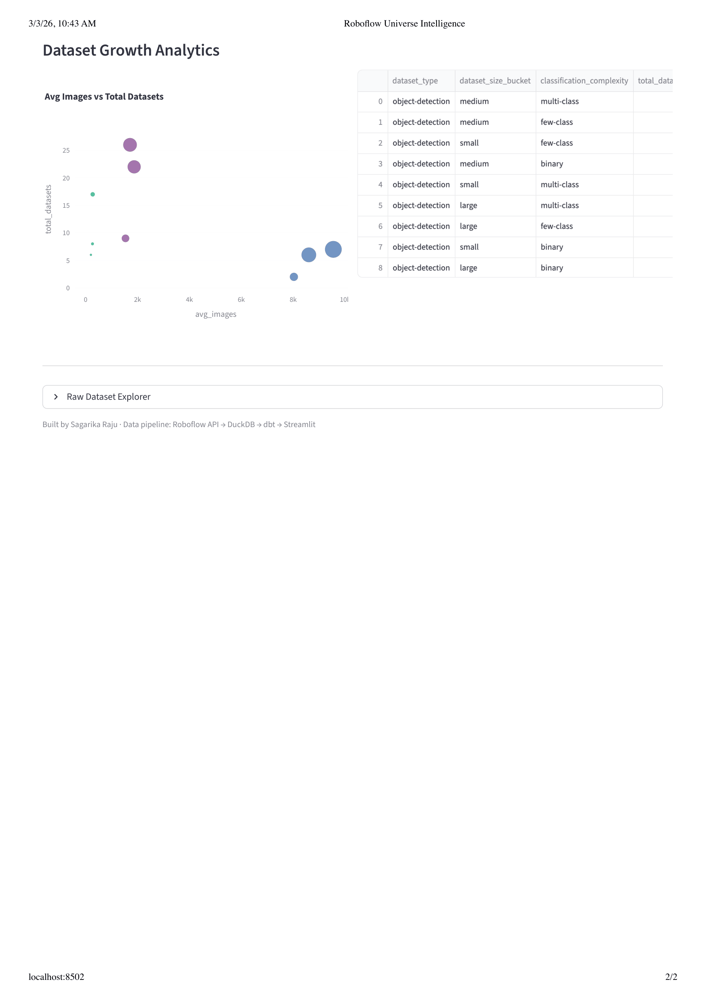

# Roboflow Universe Intelligence Platform

Self-serve analytics platform for Roboflow's public dataset ecosystem, built to demonstrate data infrastructure capabilities using the Roboflow Universe API.

## What It Does

- Ingests 100+ public datasets from the Roboflow Universe API into a local DuckDB warehouse
- Transforms raw data using dbt with a clean staging and marts layer
- Surfaces a self-serve Streamlit dashboard for non-technical stakeholders
- Designed to be cloud-portable to BigQuery or Snowflake with minimal changes

## Architecture

```
Roboflow Universe API
        |
        v
  extract_roboflow.py        # Python ingestion script
        |
        v
  DuckDB Warehouse           # raw.universe_datasets
        |
        v
  dbt Transformations
    staging/stg_datasets     # clean + standardize raw data
    marts/dataset_growth     # analytics by size and complexity
    marts/top_categories     # top datasets by image count
        |
        v
  Streamlit Dashboard        # self-serve analytics UI
```

## Tech Stack

| Layer | Tool |
|---|---|
| Ingestion | Python, Roboflow API |
| Warehouse | DuckDB |
| Transformation | dbt Core + dbt-duckdb |
| Dashboard | Streamlit + Plotly |


## Dashboard Features

- KPI metrics: total datasets, total images, avg classes, unique workspaces
- Dataset size distribution (small / medium / large)
- Classification complexity breakdown (binary / few-class / multi-class)
- Top 10 datasets by image count
- Interactive scatter plot of dataset growth analytics
- Raw dataset explorer with search

## Dashboard Preview




## How To Run Locally

**1. Clone the repo**
```bash
git clone https://github.com/saga0302/roboflow-universe-intelligence.git
cd roboflow-universe-intelligence
```

**2. Install dependencies**
```bash
python -m venv venv
source venv/bin/activate
pip install dbt-core dbt-duckdb duckdb requests pandas streamlit plotly python-dotenv pytest
```

**3. Add your Roboflow API key**
```bash
echo "ROBOFLOW_API_KEY=your_key_here" > .env
```

**4. Run the ingestion pipeline**
```bash
python ingestion/extract_roboflow.py
```

**5. Run dbt transformations**
```bash
cd dbt_project
dbt run
cd ..
```

**6. Launch the dashboard**
```bash
streamlit run dashboard/app.py
```

## Cloud Portability

This project uses DuckDB locally for zero-cost development. The same dbt models are designed to run against BigQuery or Snowflake by updating the `profiles.yml` adapter — no SQL changes required.

## Author

Sagarika Raju · [LinkedIn](https://www.linkedin.com/in/sagarika-raju-ab28051a5/) · [GitHub](https://github.com/saga0302)
